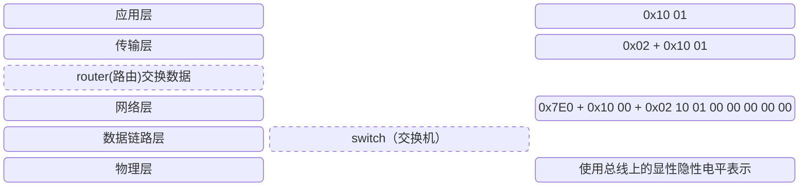
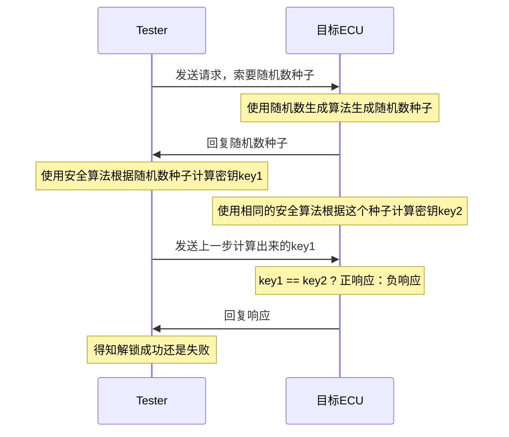
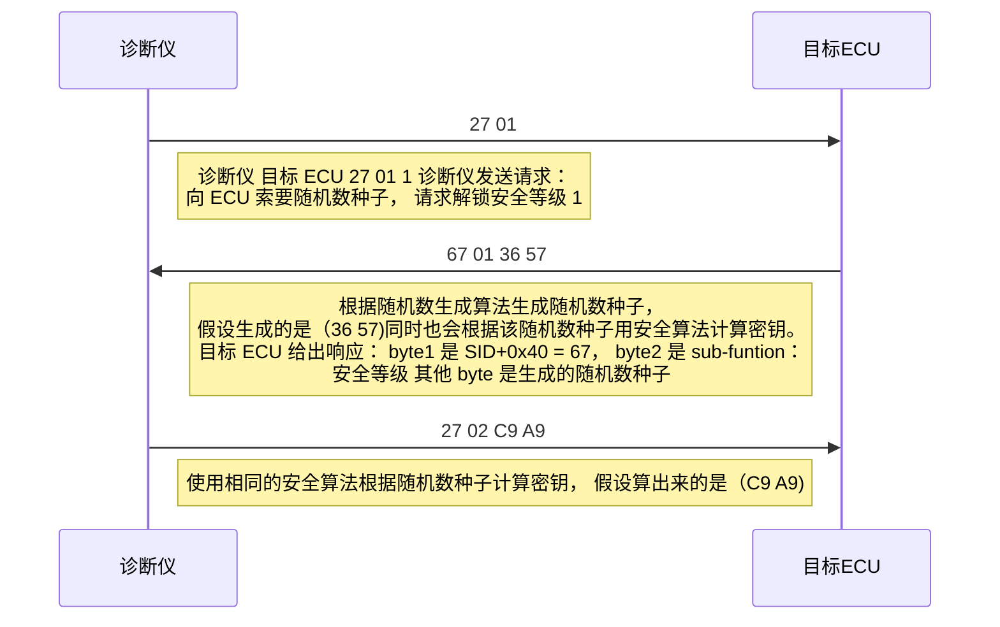
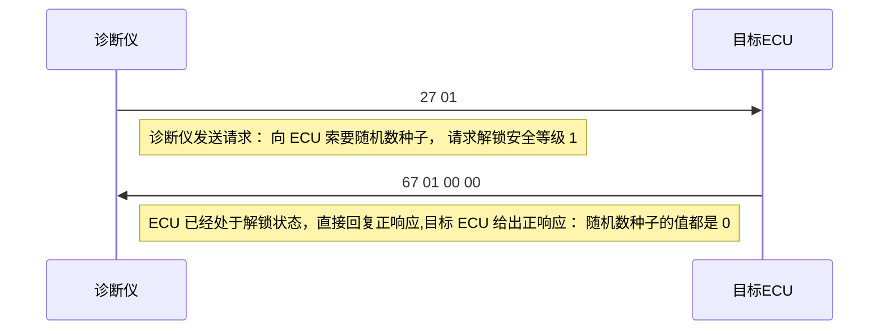
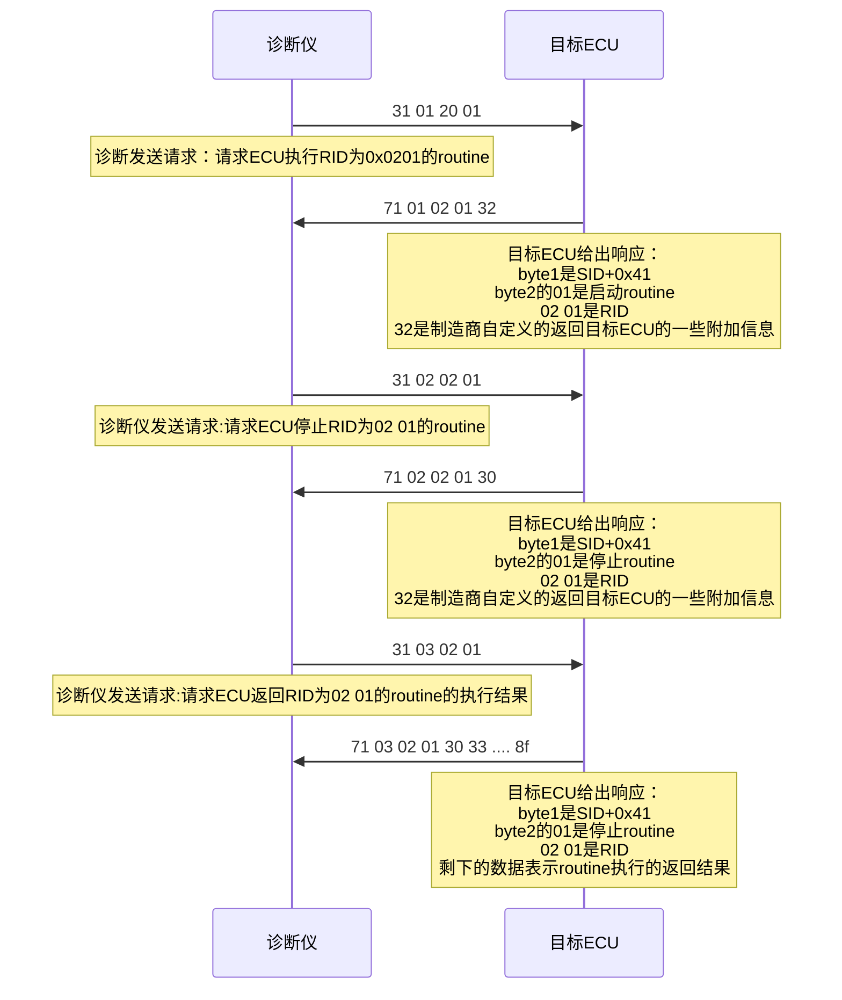
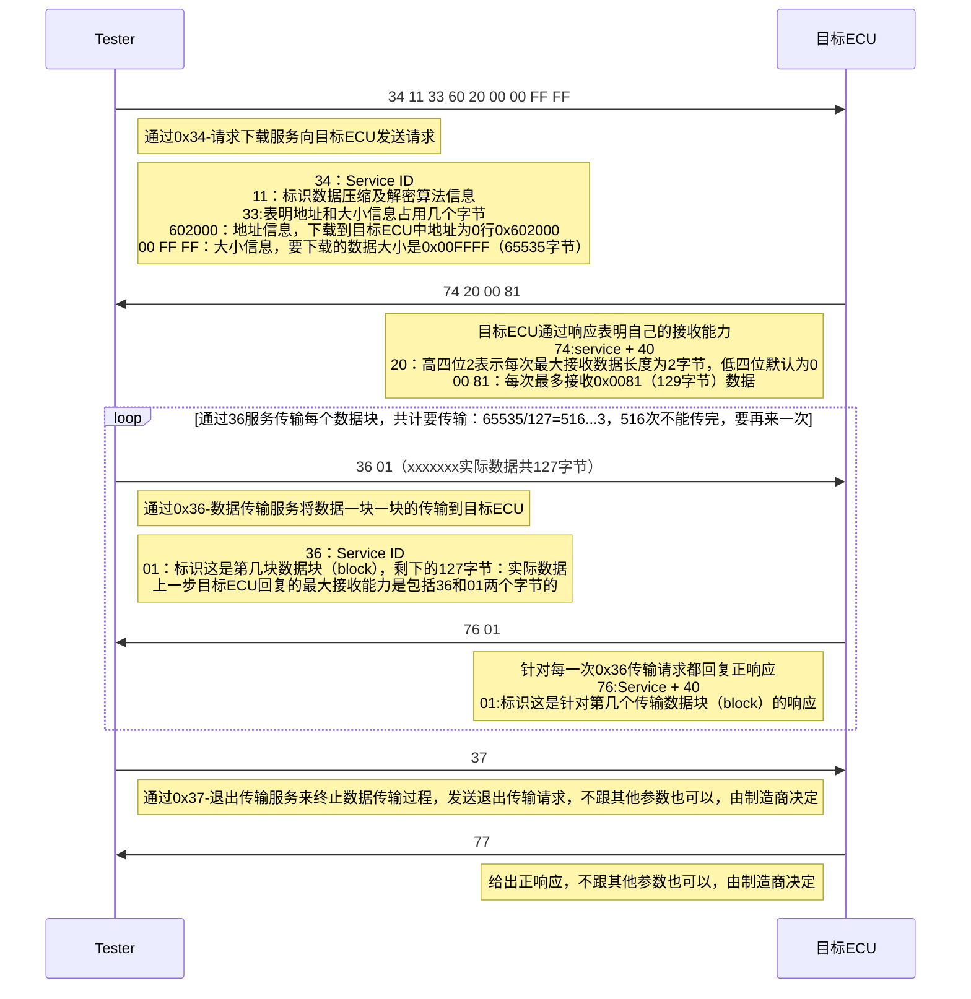

# 参考链接

[《UDS协议从入门到精通（UDS速查手册）》（完结撒花版）_obdonuds-CSDN博客](https://blog.csdn.net/qq_40309666/article/details/130831416)

# 简介

UDS (Unified Diagnostic Services) 是一种标准化的==车辆诊断协议==，广泛应用于汽车电子控制单元（ECU）的诊断和维修。它是ISO 14229标准的一部分，主要用于车辆诊断、故障排除、软件更新和其他与车辆维护相关的服务。

# UDS协议栈

UDS（Unified Diagnostic Services）协议栈是实现UDS协议功能的分层架构，确保汽车电子控制单元（ECU）与诊断工具之间的通信。UDS协议栈通常包括以下几层：

1. 应用层（Application Layer）：应用层是UDS协议栈的最高层，负责实现具体的诊断服务。它定义了各种诊断服务，如读取数据、清除故障码、重置ECU等。这一层的功能由==ISO 14229标准==规定。
2. 传输层（Transport Layer）：传输层负责数据的分段、重组和流量控制。UDS协议通常使用ISO 15765-2（CAN TP）作为其传输层协议。传输层处理较大的诊断消息，通过将它们分成较小的帧进行传输，然后在接收端重组这些帧。
3. 网络层（Network Layer）：网络层管理数据包的寻址和路由。在UDS协议中，网络层通常依赖于ISO 15765-3标准，这一标准定义了如何在CAN网络上传输诊断信息。网络层确保诊断消息能够正确到达目标ECU。
4. 数据链路层（Data Link Layer）：数据链路层负责物理网络上的数据帧传输和错误检测。在UDS协议中，数据链路层通常基于CAN（Controller Area Network）协议，由ISO 11898标准定义。数据链路层处理数据帧的发送和接收，并提供基本的错误检测和恢复机制。
5. 物理层（Physical Layer）：物理层定义了实际的硬件接口和信号传输特性。在UDS协议中，物理层通常是基于CAN总线的物理层，由ISO 11898标准定义。这一层包括信号的电气特性、连接器和传输介质（如电缆）的规范。

## 不同层的数据格式

1. **物理层**：比特（Bit）：物理层传输的是原始的二进制数据，即 0 和 1 的比特流。

2. **数据链路层**：帧（Frame）：数据链路层的 PDU 是帧，它包括数据包的开始和结束标志、帧同步信息、地址信息、控制信息以及实际的数据负载。

3. **网络层**：包（Packet）：网络层的 PDU 是包，它包括源和目的地址、生存时间（TTL）、协议类型等信息，以及数据负载。

4. **传输层**：段（Segment）：传输层的 PDU 是段，它包括端口号、序列号、确认号、控制位和其他传输控制信息，以及数据负载。

5. **会话层**：会话（Session）：会话层的 PDU 通常指的是会话，它负责建立、管理和终止应用程序之间的会话。

6. **表示层**：消息（Message）：表示层的 PDU 是消息，它负责数据的表示、安全和压缩。

7. **应用层**：数据（Data）：应用层的 PDU 通常指的是数据，它直接与应用程序交互，包括各种 API 调用和协议特定的数据格式。

> [!TIP]
>
> PDU 是 "Protocol Data Unit" 的缩写，意为协议数据单元。在计算机网络和通信系统中，PDU 是在不同层次之间传输的数据单位。PDU 的概念在 OSI（Open Systems Interconnection）模型中尤为重要，每个层次都会定义自己的 PDU 格式和用途。

## UDS协议栈的实现

> 现假设诊断仪向测试ECU发送了一个0x1001的报文，该诊断仪的CAN id是0x7E0

协议栈的组成及数据包格式如下：

传输层次==细节==：

*`应用`层*

   - **应用层数据**：`0x1001`

*`传输`层* 

- **数据格式**：`N_PCI` + `0x1001`
     - **N_PCI（Network Protocol Control Information）**：`0x02`，表示这是一个单帧（SF, Single Frame），并且该帧中的数据长度为 2 字节。N_PCI有以下的选择：
     - **完整的传输层数据**：`0x02 0x10 0x01`

> [!TIP]
>
> N_PCI:
>
> 1. **SF（Single Frame，单帧）：`0x0x`**
>    - 用于表示一个单帧传输，数据长度不超过 7 个字节。
>    - **N_PCI 格式**：`0x0L`，其中 `L` 表示数据的字节数（最多为 7 字节）。
>      - `0x02`：表示单帧，数据长度为 2 字节。
>      - `0x05`：表示单帧，数据长度为 5 字节。
>
> 2. **FF（First Frame，首帧）：`0x1x`**
>    - 用于表示多帧传输的首帧，当数据长度超过 7 字节时使用。
>    - **N_PCI 格式**：`0x1L`，其中 `L` 表示总的数据长度的高 12 位（最大 4095 字节）。
>      - FF 的前两个字节用于传输总的数据长度。
>      - 剩下的 6 个字节用于传输首帧中的数据。
>      - 例如，`0x10 0x12` 表示该报文的总数据长度为 18 字节（`0x12`），后面的 6 个字节是数据。
>
> 3. **CF（Consecutive Frame，连续帧）：`0x2x`**
>    - 用于在首帧之后，继续发送剩余的数据。
>    - **N_PCI 格式**：`0x2S`，其中 `S` 表示帧序号（从 1 开始，每帧递增，循环计数到 15 然后归 0）。
>      - 例如，`0x21` 表示这是第一段连续帧，`0x22` 是第二段，依此类推。
>      - CF 帧的前一个字节是帧序号，接下来的 7 个字节是数据。
>
> 4. **FC（Flow Control Frame，流控制帧）：`0x3x`**
>    - 用于控制发送方的流量，以便接收方处理数据。
>    - **N_PCI 格式**：`0x30 SS BS STmin`
>      - **SS**（流控制状态）：表示接收端的反馈状态
>        - `0x00`：继续发送（Clear to send, CTS）。
>        - `0x01`：等待（Wait, WAIT）。
>        - `0x02`：中止传输（Abort, ABORT）。
>      - **BS**（Block Size）：发送端可以在不等待流控制的情况下连续发送的帧数量。`0x00` 表示无限制。
>      - **STmin**（Separation Time minimum）：指示发送帧之间的最小时间间隔（以毫秒为单位）。
>
> 示例:
>
> 1. **单帧（Single Frame，SF）**：
>    - N_PCI = `0x02`，表示一个 2 字节的数据包。
>    - **数据**：假设数据为 `0x1001`，完整 N_PCI 数据为：`0x02 0x10 0x01`。
>
> 2. **首帧（First Frame，FF）**：
>    - N_PCI = `0x10 0x12`，表示该报文的数据总长度为 18 字节。
>    - **数据**：首帧中最多可传输 6 字节，剩下的数据会分多帧传输。
>
> 3. **连续帧（Consecutive Frame，CF）**：
>    - N_PCI = `0x21`，表示这是第一段连续帧。
>    - **数据**：7 字节数据从 `0x07` 开始。
>
> 4. **流控制帧（Flow Control Frame，FC）**：
>    - N_PCI = `0x30 0x00 0x05 0x01`：
>      - `0x30`：流控制帧，状态为 CTS（Clear to Send）。
>      - `0x00`：Block Size 为无限制，发送端可以连续发送。
>      - `0x05`：每个连续帧之间必须间隔至少 5 毫秒。

*`网络`层*

   - **数据**：`CAN ID + DLC + 数据`
     - **CAN ID**：`0x7E0`，表示这是诊断仪器发往 ECU 的消息。
     - **DLC（Data Length Code）**：`8`，表示数据长度为 8 个字节（尽管实际数据可能少于 8 字节，DLC 通常为 8）。
     - **数据**：`0x02 0x10 0x01 0x00 0x00 0x00 0x00 0x00`（CAN 总线允许的最大数据长度是 8 字节，短数据帧会用 `0x00` 填充）。
     - **网络层数据格式**：
       - `CAN ID = 0x7E0`
       - `DLC = 8`
       - `数据 = 0x02 0x10 0x01 0x00 0x00 0x00 0x00 0x00`

*`物理`层*

   - **电压信号**：物理层会将网络层的数据转换为电压信号，传输到 CAN 总线上。
     - 在 CAN 总线上，数据会以位级别的电压信号传输，其中 CAN 帧的每一位都通过电压变化（主导电平和隐性电平）来表示。

---

最终完整的报文传输：

| 层次   | 报文内容                                                     | 描述                                                      |
| ------ | ------------------------------------------------------------ | --------------------------------------------------------- |
| 应用层 | `0x1001`                                                     | 发送一个诊断请求，应用层负责生成具体的报文内容            |
| 传输层 | `0x02 0x10 0x01`                                             | N_PCI 表示单帧传输，数据长度为 2 字节，携带 `0x1001` 数据 |
| 网络层 | CAN ID: `0x7E0`, DLC: `8`, 数据: `0x02 0x10 0x01 0x00 0x00 0x00 0x00 0x00` | CAN 数据帧，CAN ID 为 `0x7E0`，数据为单帧格式，DLC 为 8   |
| 物理层 | 电压信号                                                     | CAN 总线上的电压变化用于物理传输数据                      |

# 两种常见的诊断协议

- OBD
- UDS

OBD和UDS是两种常见的诊断协议，它们在目标和应用领域上存在一些区别。OBD协议主要用于监测车辆的排放情况，通过读取车辆的故障码来判断是否符合排放标准。而UDS协议则更加全面和灵活，在各个ECU上是一种通用型的协议。

## OBD（On-Board Diagnostic）

主要用于跟汽车排放系统相关的ECU（电子控制单元，汽车上的板级控制器）的诊断。OBD协议分为两种：OBD-I和OBD-II。OBD-I是由美国为当时制造的加州汽车所制定的排放法规，随后这套法规被逐渐标准化，于是又提出了OBDII标准，包括：标准化的车载ECU数据诊断接口（SAE-J1962，也就是现在常说的OBD接口）、标准化的诊断解码工具（SAE-J1978）、标准化的诊断协议（ISO 9141-2、ISO 14230-4、ISO 15765-4）、标准化的故障码定义（SAE-J2012、ISO 15031-6）、标准化的维修服务指南（SAE-J2000），OBD-II在1996年开始实施，目前已经成为全球汽车行业的标准。**因此，OBD标准可以看作一系列标准的集合，是具有强制标准需要参照的，是由法规要求的，其最初目的是环保，用于汽车排放系统相关的ECU上**。

## UDS（Unified diagnostic services）

UDS（Unified Diagnostic Services）与OBD最大的区别就在于“Unified“上，是面向整车所有ECU的。单就UDS而言，它只是一个应用层协议（ISO 14229-1），不关心应用层以下的实现，比如执行该协议的应用层程序不关心通过何种物理传输方式实现与ECU硬件的通信，因此它既可以基于CAN线通信去实现，也能在Ethernet上实现。并且，UDS提供的是一个诊断服务的基本框架，定义了一系列的诊断服务和通用化的诊断流程，主机厂和零部件供应商可以根据实际情况选择实现其中的一部分或是自定义出一些私有化的诊断服务来，所以基于UDS协议的诊断又常常被称为Enhanced diagnosic（增强型诊断）。**可见，UDS不是法规要求的，没有统一实现标准，可以基于该协议提供的诊断请求及响应格式进行二次开发**。

**简言之，UDS服务主要用于诊断设备Tester（Client）和ECU（Server）之间的诊断通信，诊断设备（Tester）发送诊断请求（request），ECU给出诊断响应（response），通过这种“一问一答”的形式让目标ECU执行一些期望的操作，而UDS就是为不同类型诊断功能的request和response定义了统一的内容和格式。**

# 相关术语介绍

## Service ID（SID）

在UDS协议中，Service ID（SID）是指服务标识符，用于标识要执行的服务。每个服务都有一个唯一的SID，在诊断会话中通过SID来区分要执行/响应哪种服务请求。14229-1中定义了26种服务并将这些服务分为6大类：诊断和通信管理类、数据传输类、存储数据传输类、输入输出控制类、例程功能类、上传下载类。

| 大类             | SID (Hex) | 诊断服务名         | 服务Service                        |
| ---------------- | --------- | ------------------ | ---------------------------------- |
| 诊断和通信管理类 | 10        | 诊断会话控制       | Diagnostic Session Control         |
| :                | 11        | ECU复位            | ECU Reset                          |
| :                | 27        | 安全访问           | Security Access                    |
| :                | 28        | 通讯控制           | Comunication Control               |
| :                | 3E        | 待机握手           | Tester Present                     |
| :                | 83        | 访问时间参数       | Access Timing Parameter            |
| :                | 84        | 安全数据传输       | Secured Data Transmission          |
| :                | 85        | 控制DTC的设置      | Control DTC Setting                |
| :                | 86        | 事件响应           | Response On Event                  |
| :                | 87        | 链路控制           | Link Control                       |
| 数据传输类       | 22        | 通过ID读数据       | Read Data By Identifier            |
| :                | 23        | 通过地址读取内存   | Read Memory By Adress              |
| :                | 24        | 通过ID读比例数据   | Read Scaling Data By Identifier    |
| :                | 2A        | 通过周期ID读取数据 | Read Data By Periodic Identifier   |
| :                | 2C        | 动态定义标识符     | Dynamically Define Data Identifier |
| :                | 2E        | 通过ID写数据       | Write Data By Identifier           |
| :                | 3D        | 通过地址写内存     | Write Memory By Adress             |
| 存储数据传输类   | 14        | 清除诊断信息       | Clear Diagnostic Infomation        |
| :                | 19        | 读取故障码信息     | Read DTC Infomation                |
| 输入输出控制类   | 2F        | 通过ID控制输入输出 | Input/Output Control By Identifier |
| 例程功能类       | 31        | 例行程序控制       | Routine Control                    |
| 上传下载类       | 34        | 请求下载           | Request Download                   |
| :                | 35        | 请求上传           | Request Upload                     |
| :                | 36        | 数据传输           | Transfer Data                      |
| :                | 37        | 请求退出传输       | Request Transfer Exit              |
| :                | 38        | 请求文件传输       | Request File Transfer              |

## 诊断请求

诊断请求是指诊断工具向车辆发送的请求消息，用于请求执行某个服务。诊断请求消息由三个部分组成：

- SID：用于标识要执行的服务

- 子功能：这个服务还能更进一步的划分或者具有启动/暂停之类的子功能

- 实际数据

尽管服务类型不尽相同，但UDS针对这些服务定义了统一的诊断请求包的格式，每个诊断请求由1个Byte的SID + 1个Byte的 sub-function（实际上是1bit spr + 7bit sub-function）+ 不定长的实际数据构成，其格式如下所示：

spr存在的目的是告诉ECU针对某个服务请求是否需要发送正响应数据，用于减少ECU发送不必要的响应，节约系统资源：

- spr=1， 抑制正响应，即ECU不给出正响应；
- spr=0， 需要ECU给出正响应，如果某个服务没有sub-function，即没有第二个字节，那默认是要发正响应的。

## 正负响应

诊断工具向车辆发送服务请求后，如果服务执行成功，则返回的响应消息称为正响应，反之返回的响应消息称为负响应。

### 正响应报文格式

举个栗子：

0x10-诊断会话控制服务

再举个不带sub-function的例子：0x22-通过DID读数据（实际上SID和sub function都是固定的，这里的例子就是不带有sub function的报文）

### 负响应报文格式

负响应消息由两部分组成：SID和负响应码（NRC）。SID用于标识响应的服务，负响应码指示服务执行失败的原因。

——还是拿0x10-诊断会话控制服务来举例：

#### 负响应码（Negative Response Code - NRC）

在UDS协议中，负响应码用于指示服务执行失败的原因。NRC用一个字节表示，每个取值都对应一种不同的错误类型。

|             |                                  |             |                                             |
| ----------- | -------------------------------- | ----------- | ------------------------------------------- |
| NRC码       | 含义                             | NRC码       | 含义                                        |
| 0x01 - 0x0f | 暂保留；                         | 0x78        | 收到请求，延迟响应；                        |
| 0x10        | 未知错误，服务被拒绝；           | 0x79 - 0x7d | 暂保留；                                    |
| 0x11        | 不支持该服务请求；               | 0x7e        | 当前会话下子功能不支持；                    |
| 0x12        | 不支持子功能；                   | 0x7f        | 当前会话下服务不支持；                      |
| 0x13        | 消息长度或格式错误；             | 0x80        | 暂保留；                                    |
| 0x14        | 请求信息长度超出；               | 0x81        | rpm（每分钟转速）太高；                     |
| 0x15 - 0x20 | 暂保留；                         | 0x82        | rpm太低；                                   |
| 0x21        | 服务端正忙；                     | 0x83        | 当前引擎正在运行；                          |
| 0x22        | 条件不满足；                     | 0x84        | 当前引擎未运行；                            |
| 0x23        | 暂保留；                         | 0x85        | 截止当前时间引擎运行时间太短；              |
| 0x24        | 请求顺序错误；                   | 0x86        | 温度过高；                                  |
| 0x25        | 指令已经被接收，但是未被执行；   | 0x87        | 温度过低；                                  |
| 0x26        | 失败的操作导致当前操作无法执行； | 0x88        | 车速过高；                                  |
| 0x27 - 0x30 | 暂保留；                         | 0x89        | 车速过低；                                  |
| 0x31        | 参数错误；                       | 0x8a        | 油门/踏板过高（超过了当前要求的最大阈值）； |
| 0x32        | 暂保留；                         | 0x8b        | 油门/踏板过低；                             |
| 0x33        | 安全校验未通过；                 | 0x8c        | 变速器档位不在空档；                        |
| 0x34        | 暂保留；                         | 0x8d        | 变速器档位不在排挡；                        |
| 0x35        | 密钥不匹配；                     | 0x8e        | 暂保留；                                    |
| 0x36        | 已达到解锁最大错误次数；         | 0x8f        | 制动开关没有关闭                            |
| 0x37        | 超时时间未到；                   | 0x90        | 换挡杆不在驻车档；                          |
| 0x38 - 0x4f | 由扩展数据链路安全性保留；       | 0x91        | 变矩器离合器锁定；                          |
| 0x50 - 0x6f | 暂保留；                         | 0x92        | 电压过高；                                  |
| 0x70        | 不允许上传下载；                 | 0x93        | 电压过低；                                  |
| 0x71        | 数据传输中断；                   | 0x94 - 0xef | 暂保留（特定条件下）；                      |
| 0x72        | 擦除或烧写内存错误；             | 0xf0 - 0xfe | 为汽车制造商保留；                          |
| 0x73        | 块序列计数错误；                 | 0xff        | 暂保留；                                    |
| 0x74 - 0x77 | 暂保留；                         |             |                                             |

# UDS服务概览

## 诊断和通信管理类

诊断和通信管理类是UDS服务的核心部分，它提供了与ECU进行通信以及执行诊断操作的基本功能。这些功能包括诊断会话的建立和终止、ECU的重置和诊断通信的管理。通过诊断和通信管理类，技术人员可以与ECU进行交互，获取ECU的状态信息，并执行各种诊断操作。主要包括如下服务：

| Service                                                      | 功能简述                                                     |
| ------------------------------------------------------------ | ------------------------------------------------------------ |
| [0x10：诊断会话控制](#0x10：诊断会话控制)                    | 客户端控制目标ECU的诊断会话状态。                            |
| [0x11：ECU复位](#0X11:ECU复位)                               | 客户端强制让目标ECU执行复位操作。                            |
| [0x27：安全访问](#0X27:安全访问)                             | 客户端请求解锁受保护的目标ECU。                              |
| [0x28：通讯控制](https://blog.csdn.net/qq_40309666/article/details/133753230?spm=1001.2014.3001.5501) | 客户端控制目标ECU的通信行为 (在特定情况下启用或禁用ECU的某些通信功能)。 |
| [0x3E：待机握手](https://blog.csdn.net/qq_40309666/article/details/133753250?spm=1001.2014.3001.5501) | 客户端向目标ECU表明它仍然存在。                              |
| [0x85：控制DTC的设置](https://blog.csdn.net/qq_40309666/article/details/133753288?spm=1001.2014.3001.5501) | 客户端控制目标ECU中dtc的设置。                               |
| [0x83：访问时间参数](https://blog.csdn.net/qq_40309666/article/details/140093917) | 客户端使用此服务读取/修改当前通信的定时参数。                |
| [0x84：安全数据传输](https://blog.csdn.net/qq_40309666/article/details/140144010) | 客户端使用此服务执行具有扩展数据链路安全性的数据传输。       |
| [0x86：事件响应](https://blog.csdn.net/qq_40309666/article/details/133753311) | 客户端请求设置和/或控制目标ECU中的事件机制。                 |
| [0x87：链路控制](https://blog.csdn.net/qq_40309666/article/details/133753337?spm=1001.2014.3001.5501) | 客户端请求控制通信波特率。                                   |

## 数据传输类

数据传输类是用于在ECU和诊断工具之间传输数据的UDS服务类别。它提供了可靠的数据传输机制，确保数据的完整性和准确性。数据传输类包括数据的读取和写入功能，允许技术人员读取和修改ECU中的数据。此外，数据传输类还支持数据的块传输，以提高数据传输的效率。主要包括如下服务：

| Service                                                      | 功能简述                                                     |
| ------------------------------------------------------------ | ------------------------------------------------------------ |
| [0x22：通过ID读数据](https://blog.csdn.net/qq_40309666/article/details/133888416?spm=1001.2014.3001.5501) | 客户端请求读取由提供的DID标识的记录的当前值。                |
| [0x2E：通过ID写数据](https://blog.csdn.net/qq_40309666/article/details/133888945?spm=1001.2014.3001.5501) | 客户端请求写入由提供的DID指定的记录数据。                    |
| [0x23：通过地址读内存](https://blog.csdn.net/qq_40309666/article/details/139211263?spm=1001.2014.3001.5501) | 客户端请求读取所提供内存范围的当前值。                       |
| [0x24：通过ID读缩放数据/换算信息](https://blog.csdn.net/qq_40309666/article/details/139500633) | 客户端请求读取由提供的DID标识的比例数据。                    |
| [0x2A：通过周期读ID数据](https://blog.csdn.net/qq_40309666/article/details/139797796?spm=1001.2014.3001.5501) | 客户端请求调度目标ECU中的数据进行周期性传输。                |
| [0x2C：动态定义标识符](https://blog.csdn.net/qq_40309666/article/details/139946708) | 客户端请求动态定义数据标识符，这些标识符随后可能被0x22-读DID服务读取。 |
| [0x3D：通过地址写内存](https://blog.csdn.net/qq_40309666/article/details/139972203) | 客户端请求覆盖提供的内存范围。                               |

## 存储数据传输类

存储数据传输类是一种特殊的数据传输类别，用于在ECU和诊断工具之间传输存储数据。存储数据可以是ECU的配置信息、故障码或日志文件等。通过存储数据传输类，技术人员可以读取和清除ECU中的存储数据，以便进行故障诊断和维修。所涉及的两个服务都是常用服务类型。主要包括如下服务：

| Service                                                      | 功能简述                                                 |
| ------------------------------------------------------------ | -------------------------------------------------------- |
| [0x14：清除诊断信息](https://blog.csdn.net/qq_40309666/article/details/133889023?spm=1001.2014.3001.5501) | 允许客户端从目标ECU清除诊断信息(包括dtc、捕获的数据等)。 |
| [0x19：读取故障码信息](https://blog.csdn.net/qq_40309666/article/details/133889067?spm=1001.2014.3001.5501) | 允许客户端从目标ECU请求诊断信息(包括dtc、捕获数据等)。   |

## IO控制类

IO控制类是用于控制ECU输入输出（IO）功能的UDS服务类别。它提供了对ECU输入输出功能的访问和控制，包括读取和设置ECU的输入输出状态。通过IO控制类，技术人员可以与ECU的IO功能进行交互，实现对车辆系统的控制和监控。主要包括如下服务：

| Service                                                      | 功能简述                                 |
| ------------------------------------------------------------ | ---------------------------------------- |
| [0x2F：通过ID控制输入输出](https://blog.csdn.net/qq_40309666/article/details/133888989?spm=1001.2014.3001.5501) | 客户端请求控制特定于目标ECU的输入/输出。 |

## 例程功能类-调用ECU内部预置函数

例程功能类是一种特殊的UDS服务类别，它允许技术人员调用ECU内部预置的函数。这些函数可以执行特定的操作，如执行自检、执行校准或执行特殊功能。通过例程功能类，技术人员可以利用ECU内部的功能来进行诊断和维修。主要包括如下服务：

| Service                                                      | 功能简述                                                     |
| ------------------------------------------------------------ | ------------------------------------------------------------ |
| [0x31：例行程序控制](https://blog.csdn.net/qq_40309666/article/details/133889176?spm=1001.2014.3001.5501) | 客户端请求启动、停止目标ECU中的例程（简单理解就是个函数）或请求例程结果。 |

## 上传下载类

上传下载类是用于在ECU和诊断工具之间进行数据上传和下载的UDS服务类别。它提供了将数据从ECU上传到诊断工具或将数据从诊断工具下载到ECU的功能。上传下载类可用于备份和恢复ECU配置、更新ECU软件或执行其他数据传输操作。主要包括如下服务：

| Service                                                      | 功能简述                                                 |
| ------------------------------------------------------------ | -------------------------------------------------------- |
| [0x34：请求下载](https://blog.csdn.net/qq_40309666/article/details/133889193) | 客户端请求协商从客户端到目标ECU的数据传输。              |
| [0x36：数据传输](https://blog.csdn.net/qq_40309666/article/details/133889207?spm=1001.2014.3001.5501) | 客户端向目标ECU发送数据(下载)或向目标ECU请求数据(上传)。 |
| [0x37：请求退出传输](https://blog.csdn.net/qq_40309666/article/details/133889220?spm=1001.2014.3001.5501) | 客户端请求终止数据传输。                                 |
| [0x35：请求上传](https://blog.csdn.net/qq_40309666/article/details/139973558) | 客户端请求从目标ECU到客户端的数据传输。                  |
| [0x38：请求文件传输](https://blog.csdn.net/qq_40309666/article/details/140022899?spm=1001.2014.3001.5501) | 客户端请求在目标ECU和客户端之间进行文件传输。            |

# UDS服务详述

## 0x10：诊断会话控制

### 简介

会话模式是诊断领域非常重要的一个状态机，不同的会话模式是用来区分诊断服务执行权限的，而该服务正是为了实现会话模式的切换。即该服务可以通过控制ECU在不同的会话模式之间切换从而为ECU使能一组特定的服务以及功能，至于每种会话模式下使能哪些服务/功能，由遵循该协议标准的用户去决定。

**UDS协议定义了三种会话模式：**

1. 默认会话
2. 编程会话
3. 扩展会话

**不同会话模式间可以互相切换，但在一个ECU中应该始终只有一个诊断会话处于活动状态。** ECU在上电时应始终启动默认会话。如果没有启动其他会话则默认会话将在ECU通电期间一直运行。举例来说：

- ECU通常处于默认会话状态（Default Session），但很多服务需要切换到扩展会话模式中才能执行（Extended Session），当需要进行软件刷写时，则需要切换到编程会话模式（Programming Session）。
- 此外，当ECU处于非默认会话时，如果一段时间没有诊断操作，将会回退到默认会话，这时候如果想要保持在某种会话状态，可以通过[0x3E会话保持服务](https://blog.csdn.net/qq_40309666/article/details/133753250?spm=1001.2014.3001.5501)实现。

#### 会话模式切换时，ECU要做什么

14229-1标准文件中给出如下一幅图并针对各个标号过程中ECU的处理给出如下一些解释。

1. 当ECU处于默认会话状态，客户端请求启动默认会话时，ECU应完全重新初始化默认会话（不包括编程到非易失性存储器中的相关内容的初始化）。

2. 当ECU从默认会话转换到任意其他会话模式时，ECU需要停止在默认会话期间通过Response On Event（0x86）服务在ECU中配置的事件（即暂停事件响应服务）。

3. 当ECU从默认会话以外的任何诊断会话转换到默认会话以外的另一个会话时，ECU应重新初始化诊断会话，这意味着：
   - 通过Response On Event（0x86）服务在ECU中配置的每个事件都应停止；
   
   - 锁定安全访问
   
     > [!TIP]
     >
     > 该操作应重置那些依赖于要解锁安全访问的诊断功能，如DID的输入输出控制（0x2F）；
   
   - 在新会话中受支持且不依赖安全访问的所有功能都应保持不变。例如，任何配置的周期性调度程序在从一个非默认会话转换到另一个不管是否相同的非默认会话时都应保持活动状态；再比如，通信控制（0x28）和控制DTC设置（0x85）服务的状态不应受到影响，即会话切换后的状态应该跟切换前保持一致。
   
4. 当ECU从默认会话以外的任何诊断会话转换到默认会话时，应停止通过0x86服务在ECU中配置的每个事件，并启用安全访问，同时默认会话中不支持的任何其他功能应终止。

#### 不同的会话模式分别支持哪些服务

 不同会话模式支持的服务范围也不同，默认会话有很多不支持的服务，如下表所示（“x“表示支持该服务，“not applicable“表示不支持该服务）：

上表默认会话中有些支持的服务添加了一些备注（xa、b、c、d、e），其实就是说明下为什么默认会话下需要支持这几个服务，或者即使支持该服务也是有特定的场景或者限制的，具体含义如下所示：
  $x^a$：在默认会话模式中是否也允0x86服务是特定于实现的，即不一定支持该服务；
  $x^b$：如果是访问安全相关的DID则需基于安全访问服务，因此如果是该情况下要进非默认会话；
  $x^c$：如果是访问安全相关的内存区域则需要安全访问服务，因此如果是该情况下要进非默认会话；
  $x^d$：可以在默认和非默认会话中动态定义DID，因此非默认会话也支持这个服务；
  $x^e$：如果是安全相关例程需安全访问服务，因此需要非默认会话模式；需要客户端主动停止的例程也需要非默认会话模式。

### 数据包格式

#### 服务请求格式

SessionType的取值及对应含义如下（主要用的就是标出的那三个）：

| SessionType | 含义                                                         |
| ----------- | ------------------------------------------------------------ |
| 0x00        | 保留未使用（ISOSAE Reserved）                                |
| 0x01        | 默认会话模式（Default Session），一般ECU上电后的默认状态就是这个，该会话模式不需要0x3E服务维持。 |
| 0x02        | 编程会话模式（Programming Session），主要用于ECU软件的升级刷写，刷写流程涉及多类UDS服务， 没有接触过软件升级刷写的可能不太会接触到这种会话模式，暂时不用深究。 |
| 0x03        | 扩展会话模式（Extended Diagnostic Session），用于解锁需要高权限的诊断服务，基本覆盖各类服务， 最常见的就是读写DID前先进扩展会话模式。 |
| 0x04        | 安全模式（Safety System Diagnostic Session）使能所有跟车载系统安全相关的服务，比如安全气囊。 |
| 0x05 - 0x3F | 保留未使用（ISOSAE Reserved ）                               |
| 0x40 - 0x5F | 保留未使用，整车厂自定义使用（Vehicle Manufacturer Specific） |
| 0x60 - 0x7E | 保留未使用，ECU供应商/系统供应商自定义使用（System Supplier Specific） |
| 0x7F        | 保留未使用（ISOSAE Reserved）                                |

#### 服务响应格式

##### 正响应

SessionType的取值同上，SessionParameterRecord的4个字节含义如下：

| Byte1                        | Byte2                      | Byte3                          | Byte4                        |
| ---------------------------- | -------------------------- | ------------------------------ | ---------------------------- |
| $P2_{ServerMax}$ (high byte) | $P2_{ServerMax}$(low byte) | $P2^*_{ServerMax}$ (high byte) | $P2^*_{ServerMax}$(low byte) |

这四个字节实际上是两个时间参数的值（$P2_{ServerMax}$ & $P2^*_{ServerMax}$），可以简单理解为Server端接收到请求后如果未在指定的时间参数内给出响应，则需要执行超时操作。

##### 负响应

可能出现的NRC及其含义如下：

| NRC  | 含义                |
| ---- | ------------------- |
| 0x12 | 子功能参数不受支持  |
| 0x13 | 消息长度错误        |
| 0x22 | 不满足请求标准/条件 |

### 通信示例

 假设现在诊断设备控制目标ECU进入编程会话模式，发送请求时设置spr位为0（即不抑制正响应），同时假设目标ECU中设置的时间参数分别为：$P2_{ServerMax}$ = 50ms (0x0032)，$P2^*_{ServerMax}$ = 5000ms (0x01F4)，通信数据包如下所示：

## 0x11：ECU复位

### 简介

#### KL15和KL30

在详细介绍该服务之前，首先了解一些基础知识：汽车上的ECU都需要供电，通常有两类供应电源，一类是长期处于电池包供电状态的常电电源，另一类可以称为唤醒电或者钥匙电，顾名思义就是用于钥匙开关启动车辆后才会被正常供电的ECU；在汽车行业中，常听到的KL15和KL30就跟他们有关，实际上KL15和KL30是指电线规格或线束的命名，这两条电线在汽车的电路系统中起着不同的作用，KL15线提供点火开关激活时的电源，而KL30线提供持久的电源供应。

**KL15线** 通常用于汽车电路中的"常电"或"ACC电源"，指的是在汽车点火开关处提供电源的线路。当点火开关处于ON或ACC档位时，KL15线会激活电路，使得车辆的电子设备（如收音机、电脑等）可以正常工作。KL15线的电压通常为12V。

**KL30线** 则是指汽车电路中的"主电"或"电池正极"，它是直接连接到车辆电池正极的电线。KL30线提供持久的电源供应，使得车辆的主要电子设备（如发动机控制单元、空调系统、灯光等）可以正常工作。KL30线的电压通常也为12V。

#### ECU复位服务

该服务请求ECU根据请求消息中的ResetType参数的值执行不同类型的ECU重置。重置成功后（ECU正响应该服务请求），进入Default Session（默认会话模式）。

2020版的ISO14229-1标准中指出，当Client向Server发送0x11服务请求时，Server可在复位行为完成之后或者开始复位行为之前给到Client诊断响应，但14229-1强烈推荐的一种做法是：“**当Server接收到来自Client的0x11服务请求时，Server应当先给出诊断响应然后开始重启行为**（==先响应后重启==）“。

- 一方面，几乎所有ECU软件设计中一旦走复位重启流程，已经不记得之前发生过什么，不知道收到什么请求，又要给谁发响应；
- 另一方面，如果请求11诊断服务时未抑制正响应，在复位完成之前，一般都会先回复NRC 0x78让Client进行等待，那么Client需要根据不同的ECU节点的回复做超时监控，这无疑增加了Client的负担，对于Client而言，最为简单的方法就是发送完请求，各ECU节点回复正响应，然后各自完成复位操作即可。

此外，建议在复位操作执行期间，ECU不要接受任何请求消息以及不要发送任何响应消息，避免发生意料之外的问题。

#### ECU复位服务应用场景

 一般而言，对于0X11诊断服务，主要应用场合如下：

- ECU被刷写新的软件后，此时需要通过0X11服务重启该ECU使其恢复到初始状态；
- 在产线下线标定的过程中，对于KL30供电的ECU存在一些仅在下电时存储的数据，此时需要通过0X11诊断服务使ECU走下电流程进而完成相应数据的保存；
- 为满足特定功能的需要，输入相关标定参数给到ECU后，只有通过发送服务0X11才能使得标定参数生效的场景；
- 对于KL30供电的ECU节点，可以使用诊断服务0X11使ECU快速进入休眠的场景。

### 数据包格式

#### 服务请求格式

 对于请求消息中Reset Type的取值及其含义如下表所示：

| 复位类型                                                     | 取值        | 含义/复位特点                                                |
| ------------------------------------------------------------ | ----------- | ------------------------------------------------------------ |
| ----                                                         | 0x00        | 保留                                                         |
| HardReset (硬复位)                                           | 0x01        | 模拟KL30电源的重上电，该复位基本可以等同于Server直接掉电然后重启， 主要用于需要彻底复位的场景，比如刷写之后的复位 |
| KeyOffOnReset (点火开关复位)                                 | 0x02        | 模拟KL15点火钥匙的重启，此类复位用于模拟点火开关从off–>on的过程， 一般而言NVM数据会保持不变，VM将重新初始化 |
| SoftReset (软复位)                                           | 0x03        | 效果同上，只是复位没有那么彻底，在无需初始化任何数据的前提下 重置PC指针重新运行应用程序，即RAM中的内容不会重置 |
| enableRapidPowerShutDown (使能快速休眠流程)                  | 0x04        | 即开启ECU的休眠功能，该子功能适用于非点火上电而仅采用电池供电（KL30供电）的ECU。 对于这类ECU通常情况下，当关闭钥匙电后，过段时间ECU会进入PowerOff状态（即整体下电）， 当通过0x11服务请求使用该子功能后，关闭钥匙电不会使ECU进入下电状态，而是进入休眠状态， 这种状态下，ECU可以被快速唤醒。相对于整体下电状态，休眠状态的进入和退出都更加迅速， 但同时这种状态也会多一些功耗。 |
| disableRapidPowerShutDown (抑制快速休眠流程)                 | 0x05        | 适用于非点火上电而仅采用电池供电（KL30供电）的ECU，抑制其进入下电休眠流程 |
| vehicleManufacturerSpecific (供整车制造商使用的自定义复位类型) | 0x40 - 0x5F | 整车厂自定义                                                 |
| systemSupplierSpecific (供系统供应商使用的自定义复位类型)    | 0x60 - 0x7E | 零部件供应商自定义                                           |
| ----                                                         | 7F          | 保留                                                         |

#### 服务响应格式

##### 正响应

ResetType：取值及对应含义与上表相同；
  powerDownTime：该参数仅在subfunction(即ResetType)=0x04时才会有，指的是ECU断电过程中保持待机状态的最小时间，即指示这个ECU至少要多久才能进入休眠状态。其他情况下，Server只回复前两个字节，该参数取值范围为0x00-0xFE(254s)，0xFF为无效值。

##### 负响应

| NRC  | 含义                                                         |
| ---- | ------------------------------------------------------------ |
| 0x12 | 子功能参数不受支持                                           |
| 0x13 | 消息长度错误                                                 |
| 0x22 | 不满足请求标准/条件                                          |
| 0x33 | 由于复位操作影响ECU正常功能或者状态，有一定的危险性，所以标准中对于这个服务提供了该NRC， 主机厂在实现该协议时可以（而不是必须）将复位请求定义在安全解锁状态下才能执行， 如果ECU未被解锁，请求重置将受到保护（Server在响应复位请求时处于security lock状态），就回复这个NRC。 |

### 通信示例

假设现在目标ECU处于钥匙电上电状态，但不应处于运行模式（毕竟不能在开车过程中复位，即如果是燃油车，动力源为发动机，发动机应关闭；如果是混动车，发动机和ISG电机都要关闭。）诊断仪发送复位请求，发送请求时设置spr位为0（即不抑制正响应），通信数据包如下所示：

## 0x27：安全访问

### 简介

#### 安全访问服务

车载ECU中的一些数据或者操作是比较重要的，对于这种企业敏感的数据或者操作肯定不是人人都能访问的，诊断服务0x27应运而生。它主要用于车载ECU数据上传或者下载，传递重要信息以及敏感操作等过程中。即对请求执行操作的人进行鉴权，只有正确解锁对应的安全等级，才能访问该安全等级的数据，否则无法访问。

#### 应用场景

- 通常在向Flash中写数据时，都需要先执行0x27安全解锁之后才能进行安全写入，最常见的就是对ECU进行软件刷写时，需要先通过0x27安全解锁才能进行后续重编程操作，否则将对ECU造成极大的安全风险；
- 使用0x31服务执行十分重要的routine时，需要优先执行0x27进行安全解锁之后才能够执行对应的routine；
- 在产线写入较为重要的版本或者标定等信息过程中，需要先使用0x27服务才能使用写操作的诊断指令，如0x2E服务；

#### 基本原理

第一回合：

1. Tester向目标ECU请求种子（“种子“：简单理解它就是个随机数）
2. 目标ECU向Tester发送种子

第二回合：

1. Tester基于接收到来自目标ECU的种子计算出对应的key并发送给目标ECU
2. 目标ECU接收来自Tester算出来的key并与内部算出的key比较，如果一致则解锁成功，否则解锁不成功

  请求+响应为一组，共两个来回，用图示方式看起来更直观一些：

### 数据包格式

#### 服务请求格式

该服务共两次请求+响应，两次请求数据包的格式不一样:

**请求种子数据包:**

**发送 key数据包:**

Tips📌：两个请求中sub-function: securityAccessType的含义

- “请求种子“数据包中，该字段必须为奇数；“发送key“数据包中该字段必须为偶数，不同的数字代表不同的安全等级
- 每一次完整的0x27服务流程中，“请求种子“和“发送key“两个数据包中该字段数值必须存在一个定量关系，即：
  “请求种子“ 的securityAccessType + 1 == “发送key“ 的securityAccessType
  例如： “请求种子“ 的securityAccessType= 0x01 ——> “发送key“ 的securityAccessType= 0x02

Tips📌：两次请求携带的数据含义

- securityAccessDataRecord: 传输到目标ECU端的标识性信息，一般不使用
- securityKey: Tester通过安全算法根据随机数种子计算出来的密钥值，发送给目标ECU

#### 服务响应格式

##### 正响应

securityAccessType：取值与请求中的sub-function值保持一致即可；

securitySeed：该参数仅在对应请求的sub-function为奇数(即“请求种子“)时才会有，其他情况下，目标ECU只会回复前两个字节（0x67 & sub-function），该参数取值范围只能为0x00-0x7F。

##### 负响应

可能出现的 NRC 及其含义如下：

| NRC含义 |                                                              |
| ------- | ------------------------------------------------------------ |
| 0x12    | 子功能参数不受支持                                           |
| 0x13    | 消息长度错误                                                 |
| 0x22    | 不满足请求标准/条件                                          |
| 0x24    | 请求顺序错误，比如应该先发送请求种子，而不是先发送密钥数据   |
| 0x31    | 请求中携带的数据是无效的                                     |
| 0x35    | 密钥不匹配，即Tester计算出来的key和目标ECU计算出来的不一样：若始终不匹配还不断尝试， ECU会回复下面的NRC=36，告诉你已经超过失败的次数了，不能再请求安全解锁了 |
| 0x36    | 超过最大试错次数，已达到解锁最大错误次数，若你执意再请求，ECU就会回复你下面的NRC=37， 意思是ECU现在不接受安全访问，这就是ECU锁死的现象，需等待一定时间后才可继续请求安全访问 |
| 0x37    | 当前服务器处于延时状态，超时时间未到                         |

Tips📌：

*   ECU 上电后，保持上锁状态，[一般进入扩展会话才能请求 0x27 服务](https://blog.csdn.net/qq_40309666/article/details/133752052?spm=1001.2014.3001.5501#diff-service)，而编程会话的安全等级与扩展会话的安全的等级不一致。所以如果想进行 ECU 软件刷写操作 flash，那进入编程会话后一般还需要再请求 0x27 服务进入另一个安全等级。
*   若已成功解锁安全等级，再请求相同层级的解锁服务，ECU 一般会回复的种子（随机数）为 0。而未解锁的安全等级下，27 服务中目标 ECU 发送来的随机数种子是不允许为 0 的。因此，可以通过判断种子的值得知当前安全等级是否处于解锁状态。
*   同一时刻，只允许有一个安全等级处于解锁状态。
*   安全等级的值没有特别的含义，不存在高低之分，比如解锁 level3 并不需要先处于 level2。

### 通信示例

假设现在需要解锁目标 ECU 的安全等级 1，并且此时目标 ECU 的这个等级处于上锁状态：

在上一步成功解锁安全等级 1 的基础上，继续发送解锁目标 ECU 的安全等级 1 的请求：

## 0x31：例程控制

### 简介

所谓“例程”，简单理解你可以认为就是个函数或者一段执行逻辑，而“例程控制”就是控制这段执行逻辑的启动、停止或者获取其执行结果，这就是0x31-例行程序控制服务的作用。每个“例程”都有一个唯一的标识，称为Routine ID(RID),以便在Ox31服务的请求中区分请求执行的是哪一个”例程”。

该服务具有很大的灵活性，但典型的使用方式有擦除内存、重置或学习自适应数据、运行自检、控制目标ECU值随时间变化等。通常情况下，该服务用于更复杂类型的输出控制，而0x2F-通过D控制输入输出用于相对简单的输出控制，大多情况下0x2F服务的功能都能够通过0x31服务来实现，不过一般不这么做，属于杀鸡用牛刀的做法。

### 数据包格式

#### 服务请求格式

各个参数的含义如下所示：

1. routineControlType(1Byte):表示要对routine进行何种控制（启动、停止、获取执行结果），取值及相应含义如下所示：

   | 取值        | 含义                                                        |
   | ----------- | ----------------------------------------------------------- |
   | 0x00        | 保留                                                        |
   | 0x01        | 启动由 routineldentifier 标识的 routine                     |
   | 0x02        | 停止由 routineldentifier 标识的routine                      |
   | 0x03        | 请求目标 ECU返回由routineldentifier 标识的routine的执行结果 |
   | 0x04 - 0x7F | 保留                                                        |

2. routineldentifier(2Byte):该参数和数据传输类服务中的DID参数类似，我们可以称它为RID,也是用来标识具体的功能的，可以理解为给各种要执行的操作(routine)一个代号。有个别RID在标准中是有明确定义的，RID相关取值如下表所示：

   | 取值            | 含义                                                         |
   | --------------- | ------------------------------------------------------------ |
   | 0x0000 - 0x00FF | 保留                                                         |
   | 0x0100 - 0x01FF | 该范围的值被保留来表示行车记录仪的测试结果值。               |
   | 0x0200 - 0xDFFF | 此值范围保留给特定的汽车制造商使用。                         |
   | 0xE000 - 0xE1FF | 这个范围的值被保留来表示OBD/EOBD 测试结果值。                |
   | 0xE200          | 此值应使用用于启动先前选择的点火回路的部署。                 |
   | 0xE201 - 0xE2FF | 保留的， 以便将来定义安全相关系统中实施的例行程序。          |
   | 0xE300 - 0xEFFF | 保留                                                         |
   | 0xF000   0xFEFF | 系统供应商定义                                               |
   | 0xFF00          | 该值用于启动目标ECU的内存擦除操作。（常用于 ECU软件升级刷写中） |
   | 0xFF01          | 该值用于检查目标 ECU的内存编程依赖关系。 比如版本检查、crc 检查等。（常用于 ECU 软件升级刷写中) |
   | 0xFF02          | 该值用于擦除目标ECU 的镜像内存 dtc。                         |
   | 0xFF03 - 0xFFFF | 保留                                                         |

3. routineControlOptionRecord(不定长)：该参数是可选的，需要根据routine的具体设计决定，比如有些routine需要额外的数据，就可以通过这个参数来传递，比如routine是用来进行数据校验的，需要把标准值告诉目标ECU,这样目标ECU就可以根据自身计算结果和接收到的标准值进行比较，来判断校验结果。

#### 服务响应格式

##### 肯定响应

   

1. routineControlType和routineldentifier的定义跟请求消息中的保持一致。
2. routinelnfo(1Byte)：该参数是可选的，用于在执行相应routine后，返回routine相关信息，具体该参数用做什么由制造商做决定。
3. routineStatusRecord(不定长)：该参数也是可选的，用于在执行相应routine后，返回目标ECU相关信息（比如通过3102服务请求目标ECU停止routine时，目标ECU可以通过该参数返回该routine运行时间等信息)，可根据实际需要进行使用，很少用到。

##### 否定响应

可能出现的NRC的含义：

| NRC C | 含义                                                         |
| ----- | ------------------------------------------------------------ |
| 0x12  | 子功能不受支持                                               |
| 0x13  | 消息长度错误                                                 |
| 0x22  | 当前条件不满足                                               |
| 0x24  | 三种情况下返回该 NRC：  ①当收到“startRoutine”子功能时， 流程当前正在进行且无法重新启动 （是否可以在活动状态下重新启动取决于车辆制造商）；  ②当收到“stopRoutine”子功能时， 流程当前未处于活动状态；  ③当收到“requestRoutineResults”子功能时， 流程结果不可用（例如，所请求的流程标识从未启动）。 |
| 0x31  | 请求参数不受支持，参数错误                                   |
| 0x33  | 未通过安全访问                                               |
| 0x72  | 如果目标ECU在执行与其内部存储器访问有关的流程时检测到错误， 0x72返回该NRC。例如，当流程擦除或编程永久存储器设备(如Flash存储器)中的某个内存位置时，访问该内存位置失败。 |

NRC的处理流程如下：

### 示例

Tester分别发送启动、停l止、返回执行结果三类routine控制请求，不抑制正响应，通信流程如下所示：

## 0x34：请求下载

### 简介

#### 为何需要上传下载类服务？

参加过嵌入式软件开发工作的同志应该知道，MCU中的资源是有限的。在复杂的车载操作系统中，为了尽可能的降低汽车开发成本，在ECU的芯片选型上通常也比较严格，软件开发代码的编写也会考虑资源的利用效率，比如芯片RAM空间的使用情况。

例如用于缓存ECU诊断数据的那块buffer通常是有限的，为了向ECU中写入数据，可以使用我们前面提到过的0x2E服务（通过ID写数据）。但当要写入的数据块很大时（最常见的就是升级ECU软件，通常数据量是要上KByte甚至MByte的)，为诊断数据定义的buffer已经不能满足使用需求。于是，上传下载类服务应运而生，他们主要用于大块数据的读取或写入。

#### 0x34服务的作用

该服务用于启动数据传输服务，传输方向是Tester(Client)→目标ECU(Server),向目标ECU发送该请求的==主要作用就是告知目标ECU"我(Tester)准备向你传输数据了，请你（目标ECU)准备接收数据”==。

目标ECU正确收到该请求消息后，可以发送响应告诉Tester自己是否允许传输数据，以及自己的接受能力是多大，如果可以传输，目标ECU应采取一切必要措施接收数据，然后再发送肯定响应消息。

### 数据包格式

#### 服务请求格式

==该服务不支持sub-function==。部分参数的含义如下所示：

1. dataFormatldentifier(1Byte):这个单字节里面标识了数据格式相关的信息，每半个字节分别编码，==高半字节==指定“==数据压缩方法==”，而==低半字节==则指定“==数据加密方法==”。如果该字节取值为0x00,则表示既不使用加密方法也不适用压缩方法，其他取值情况有整车制造商或者供应商决定，可以用约定好用不同的取值代表数据是否有压缩，是否有加密，用的又是什么算法等等。
2. addressAndLengthFormatldentifier(1Byte):该参数含义在图中标识的已经比较清晰，不再赘述。比如memoryAddressa参数占用m个字节，memorySize参数占用n个字节，则该参数取值为0x(nm)。
3. memoryAddress(mByte):对于即将启动的数据传输，该参数指明了向ECU内存写入数据的逻辑地址。比如Tester请求将数据写入ECU内存地址为0x12345678的地方（该地址占4个字节)，则memoryAddress值为0x12345678,对应addressAndLengthFormatldentifier参数低4Bits值为0x04。
4. memorySize(nByte):对于即将启动的数据传输，该参数指明了向ECU内存写入数据的字节数。比如Testeri请求写入ECU数据的字节数为0x01234567(即memorySize占4字节)，则memorySize值为0x01234567,对应的addressAndLengthFormatldentifier高4Bits值为0x40。

#### 服务响应格式

##### 肯定响应

1. lengthFormatldentifier(1Byte):该字节每半个字节单独编码，高4Bits为maxNumberOfBlockLength有效字节长度，低4Bits保留为0。
2. maxNumberOfBlockLength:字节长度不定，取值长度取决于lengthFormatldentifier的高半字节，表示0x36服务一次传输一个block的最大的字节数。比如该参数取值为0x202,则使用0x36服务时，一次最多发送字节数为0x202(字节数：0x202>=36(1Byte)+parameter(x个Bytes)）。

##### 否定响应

可能出现的NRC：

| NRC  | 含义                                                         |
| ---- | ------------------------------------------------------------ |
| 0x13 | 消息长度错误                                                 |
| 0x22 | 当前条件不满足                                               |
| 0x31 | 请求参数不受支持，参数错误                                   |
| 0x33 | 未通过安全访问                                               |
| 0x70 | 由于某些故障导致无法下载到目标ECU的指定内存中（比如没有执行擦除就直接 写入） |

NRC的处理流程如下（推荐的错误情况检查顺序）：

## 0x3D：通过地址写内存

## 0x36：数据传输

### 简介

该服务用于在Tester和目标ECU之间传输数据，可以是从Tester向目标ECU传输（下载)或从目标ECU向Tester传输（上传)。数据传输方向由前面的0x34-RequestDownload或0x35-RequestUpload)服务定义。==即0x36服务必须在0x34或0x35服务之后才能正常执行==。

- 如果Tester发起了0x34-RequestDownload请求，则要下载的数据包含在该服务请求消息中的transferRequestParameter参数中；
- 如果Tester发起了0x35-RequestUpload请求，则要上传的数据包含在该服务响应消息中的transferResponseParameter参数中。

### 数据包格式

#### 服务请求格式

==该服务不支持sub-function==。部分参数的含义如下所示：

1. blockSequenceCounter(1Byte):参数的初始值为0x01,从RequestDownload(0x34)或RequestUpload(0x35)服务后的第一个TransferData请求开始。每个后续的TransferData请求，blockSequenceCounter的值递增1。当blockSequenceCounter的值达到0xFF时，它将重新变为0x00,然后随着下一个TransferData请求继续递增。
   以数据下载过程中该服务的使用为例，可以看到该参数的作用：
   - 如果下载数据的TransferData请求在目标ECU中已经被正确接收和处理，但目标ECU发出的正响应消息未能到达Tester,则Tester会检测到超时，并重复相同的请求（包括相同的blockSequenceCounter)。于是目标ECU会接收到重复的TransferDatai请求，并根据包含的blockSequenceCounteri确定这是一个重复的请求。这是目标ECU会立即发送正响应消息，而无需再次写入数据到其内存中。
   - 如果下载数据的TransferData请求在目标ECU中未能正确接收，则目标ECU不会发送正响应消息。于是Tester端会检测到超时，并重复相同的请求（包括相同的blockSequenceCounter)。目标ECU会接收到重复的TransferData请求，并根据包含的blockSequenceCountert确定这是一个新的请求。服务器会处理该服务，并发送正响应消息。
2. transferResponseParameterRecord(不定长)：这个参数记录包含目标ECU需要支持数据传输的参数。这些参数的格式和长度是由车辆制造商指定的。例如，在下载操作中，transferRequestParameterRecord包含要传输的数据。

#### 服务响应格式

##### 肯定响应

1. blockSequenceCounter(1Byte):跟请求消息中的保持一致。
2. transferResponseParameterRecord(不定长)：这个参数的格式和长度是由车辆制造商指定的。例如，在下载操作中（上一条请求是0x34)，那么该参数可能包含目标ECU根据请求下载的数据计算得出的校验和。在上传操作中（上一条请求是0x35)，该参数包含要上传的数据。在下载操作中，该参数不应与transferRequestParameterRecord重复。

##### 否定响应

可能出现的NRC及其含义如下：

| NRC       | 含义                                                         |
| --------- | ------------------------------------------------------------ |
| 0x13      | 消息长度错误                                                 |
| 0x24      | 两种情况会回复这个NRC： ①收到0x36请求时，0x34/0x35服务未处于活动状态，也就是在这之前没 收到上传下载请求； ②之前收到了上传下载请求，但目标ECU已根据上一次请求中的 memorySize参数接收到了所有的数据； |
| 0x31      | 请求参数不受支持，参数错误                                   |
| 0x71      | 如果下载模块的长度不符合0x34-请求下载服务请求消息中的 memorySize参数的要求，则应返回此NRC。 |
| 0x72      | 一 般的刷写错误，比如写flash出错                             |
| 0x73      | 如果目标ECU检测到blockSequenceCounter的序列错误，应返回此 NRC。 注意，如果请求消息的blockSequenceCounter与前一个请求消息中的 blockSequenceCounter相等， 则目标ECU应接受重复的那个TransferData请求消息。 |
| 0x92/0x93 | 电压条件不满足，比如目标ECU的主电源引脚上测量到的电压超出了下载 数据到其永久存储器（例如闪存）的可接受范围 |

NRC的处理流程如下：

## 0x37：请求退出

### 简介

不管是数据上传还是下载过程，该服务由Tester发起，==用于终止Tester和目标ECU之间的数据传输==。

### 数据包格式

#### 服务请求格式

格式很简单，没什么要做特别说明的，其中transferRequestParameterRecord参数应包含目标ECU需要支持数据传输所需的参数。该参数的格式和长度是是由车辆制造商决定的。

#### 服务响应格式

##### 肯定响应

跟请求消息一样，格式很简单，没什么要做特别说明的，其中transferResponseParameterRecord参数应包含Tester需要支持数据传输所需的参数。该参数的格式和长度是也是由车辆制造商决定的。

##### 否定响应

可能出现的NRC及其含义：

| NRC  | 含义                                                         |
| ---- | ------------------------------------------------------------ |
| 0x13 | 消息长度错误                                                 |
| 0x24 | 两种情况会回复这个NRC： ①0x36传输过程还没结束就收到这个请求； ②之前压根儿没收到过上传下载请求（0x34or0x35）； |
| 0x31 | 请求参数不受支持，参数错误                                   |
| 0x72 | 一般的刷写错误，比如目标ECU在终止数据传输时发生错误          |

NRC的处理流程：

### 通信示例

基于对0x34、0x36、0x37三个服务的学习，这里举一个完整的例子，该示例实现：==通过Tester将数据下载到目标ECU中==，该示例最为常用的场景就是在车载ECU软件升级过程中更新目标ECU flash中的软件。数据下载到目标ECU的过程分三步：

1. Tester通过0x34-请求下载服务向目标ECU发送请求，该请求消息中将包括数据的格式信息（是否压缩、加解密信息）、数据要往哪个地址写、要写入多少字节的数据。目标ECU收到该请求后将通过响应告诉Tester:“我（目标ECU)每次最多能接收多少自字节”，即目标ECU会表明自己每次的接收能力。
2. Tester得知目标ECU每次接收能力后，将要传输过去的数据按照目标ECU接收能力拆分成一个个数据块(block)，通过0x36-数据传输服务将数据一块块的传输到目标ECU。
3. Tester端数据传输完成后，通过发送0x37-退出传输服务请求来终止数据传输过程。

在钥匙电开启，发动机关闭，车速为0的背景下，Tester7和目标ECU间的通信过程如下图所示：

